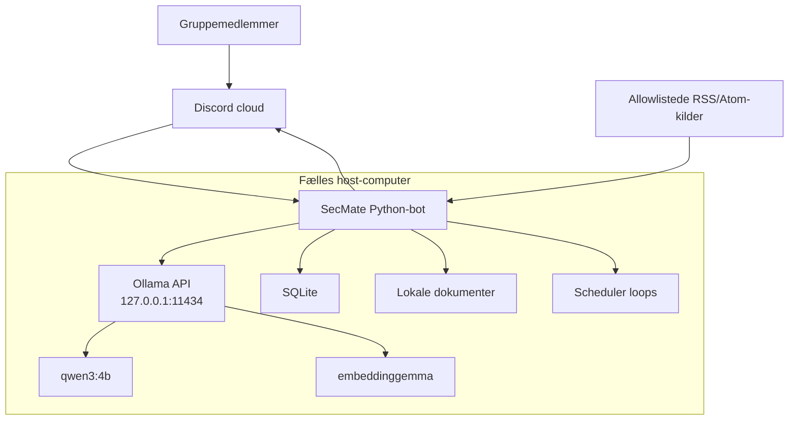
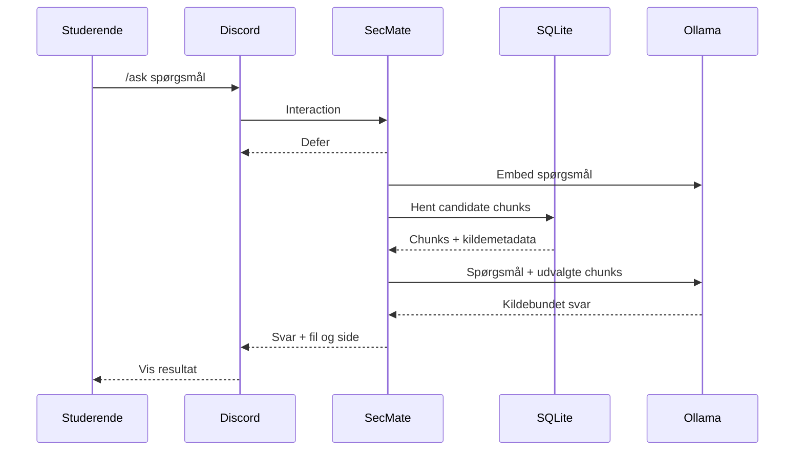

# Arkitektur

## 1. Systemgrænse

Discord er en ekstern cloudtjeneste og brugerflade. Alt andet kører på én host-computer, som gruppen kontrollerer. Ollama må ikke eksponeres for LAN eller internet.



## 2. Teknologistak

| Ansvar | Teknologi | Drift/ejerskab |
|---|---|---|
| Chat-interface | Discord application commands | Discord Inc. |
| Bot/backend | Python 3.12 + `discord.py` | Gruppens host |
| Lokal chat-AI | Ollama + `qwen3:4b` | Gruppens host |
| Semantic retrieval | Ollama + `embeddinggemma` | Gruppens host |
| Vedvarende data | SQLite + `aiosqlite` | Gruppens host |
| PDF-tekst | `pypdf` | Gruppens host |
| RSS/Atom parsing | `feedparser` | Gruppens host |
| HTTP | `aiohttp` (kommer transitivt med discord.py, men deklareres direkte hvis brugt) | Gruppens host |
| Periodiske jobs | `discord.ext.tasks` | Botprocessen |
| Tests/kvalitet | pytest, pytest-asyncio, ruff, mypy, pip-audit | Udviklingsmiljø/CI |

Codex skal oprette og fryse faktiske dependency-versioner i lock/requirements-filer under implementeringen. Verificerede referenceversioner 15. september 2026 omfatter `discord.py 2.7.1`, `ollama 0.6.2`, `aiosqlite 0.22.1`, `feedparser 6.0.14`, `pypdf 6.18.1` og `python-dotenv 1.2.3`. Brug kompatible patch-versioner og kør hele testsuiten efter resolution.

## 3. Foreslået kodearkitektur

```text
secmate/
├── pyproject.toml
├── requirements.txt
├── requirements-dev.txt
├── .env.example
├── .gitignore
├── AGENTS.md
├── README.md
├── docs/
├── data/
│   ├── documents/
│   └── backups/
├── logs/
├── migrations/
│   └── 001_initial.sql
├── scripts/
│   ├── doctor.py
│   ├── ingest_documents.py
│   ├── backup_db.py
│   └── smoke_test.py
├── src/secmate/
│   ├── __init__.py
│   ├── __main__.py
│   ├── app.py
│   ├── config.py
│   ├── logging_config.py
│   ├── errors.py
│   ├── commands/
│   │   ├── ask.py
│   │   ├── assistant.py
│   │   ├── memory.py
│   │   ├── deadlines.py
│   │   ├── news.py
│   │   ├── today.py
│   │   └── admin.py
│   ├── services/
│   │   ├── ollama_service.py
│   │   ├── rag_service.py
│   │   ├── ingestion_service.py
│   │   ├── news_service.py
│   │   ├── digest_service.py
│   │   ├── agent_service.py
│   │   └── backup_service.py
│   ├── repositories/
│   │   ├── database.py
│   │   ├── memory_repository.py
│   │   ├── deadline_repository.py
│   │   ├── document_repository.py
│   │   ├── news_repository.py
│   │   └── job_repository.py
│   ├── scheduling/
│   │   └── loops.py
│   └── utils/
│       ├── discord_text.py
│       ├── ids.py
│       ├── time.py
│       └── validation.py
└── tests/
    ├── unit/
    ├── integration/
    ├── fixtures/
    └── fakes/
```

## 4. Runtime-fordeling

### Bot-process

Har Discord Gateway-forbindelse, validerer commands, bruger repositories/services og afvikler scheduler-loops. Den må aldrig læse vilkårlige beskeder fra kanaler.

### Ollama-process

Kører separat på samme host. Botten kalder kun loopback-adressen. Modellen behøver ingen Discord-token og må ikke have fri adgang til tools.

### SQLite

Én fil er tilstrækkelig til MVP. Slå `PRAGMA foreign_keys=ON`, `journal_mode=WAL`, `busy_timeout=5000` til ved forbindelser. Alle skemaændringer sker via nummererede migrations.

### Dokumentmappe

Kun host-ansvarlig placerer filer. Discord-brugere må ikke uploade eller vælge stier. Ingestion må kun resolve filer under den konfigurerede dokumentrod og må afvise symlinks, der forlader roden.

## 5. `/ask` sekvens



Implementationsdetalje: for en lille studiesamling kan embeddings indlæses fra SQLite og rangeres i Python. Gem dem som little-endian float32 BLOB med eksplicit dimension/model. Brug dot product, fordi Ollamas embed-output er L2-normaliseret. Hvis samlingen senere bliver stor, kan retrieval-laget udskiftes uden at ændre Discord commands.

## 6. Agent-loop

`/assistant` er det tydeligste agentiske element:

1. Model modtager brugerens mål og beskrivelser af fire allowlistede read-only tools.
2. Modellen vælger nul eller flere tools.
3. Koden validerer toolnavn og argumenter.
4. Toolresultat returneres til modellen.
5. Stop ved endeligt svar eller efter maks. 4 runder.

Agenten må ikke kalde write-tools i MVP. Ændringer sker via strukturerede slash commands, så deadlines og hukommelse ikke ændres på baggrund af modelhallucinationer.

## 7. Scheduler-design

Brug ét minut-loop, der:

- beregner lokal `Europe/Copenhagen`-tid med `zoneinfo`
- finder jobs, der er forfaldne
- opretter en unik `job_runs(job_name, guild_id, local_date)`-række i en transaction
- sender kun hvis insert lykkes
- opdaterer status efter send
- tillader retry ved fejl med et begrænset antal forsøg

En unik constraint forhindrer dobbelte daglige beskeder efter genstart. Lagrede deadline-tidspunkter er UTC; visning konverteres til dansk lokaltid.

## 8. Degraderet drift

| Fejl | Systemadfærd |
|---|---|
| Ollama nede | AI-kommandoer viser hjælp; deterministic commands virker |
| Chatmodel mangler | `/health` viser præcis pull-kommando |
| Embedmodel mangler | ingestion/ask stopper uden at ødelægge indeks |
| Discord mister forbindelse | Bibliotekets reconnect bruges; scheduler må ikke duplikere |
| Ét feed fejler | Andre feeds fortsætter; fejl logges uden indhold |
| PDF uden tekst | Fil ignoreres med OCR-besked |
| SQLite låst | Kort retry/busy timeout; brugervenlig fejl |
| Konfiguration mangler | Fail fast ved kritiske værdier; valgfrie features deaktiveres tydeligt |

## 9. Deployment

MVP kører med:

```bash
python -m secmate
```

Senere kan Codex tilføje OS-autostart som dokumenteret, valgfri guide. Det må ikke blive et krav for MVP. Docker udsættes, fordi Ollama på host + GPU/Metal + Docker-netværk ellers gør første opsætning mindre stabil.

