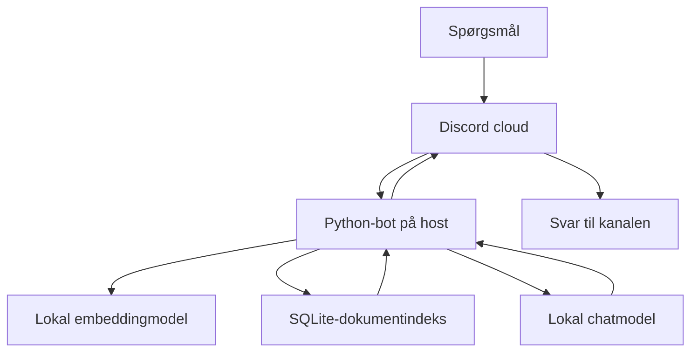
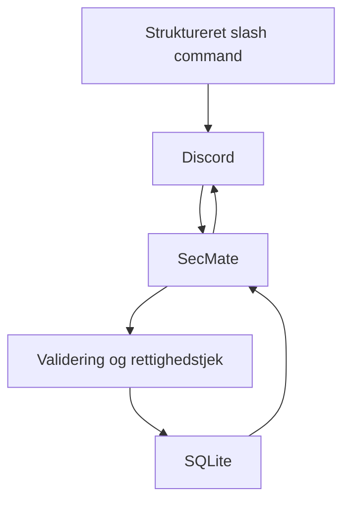
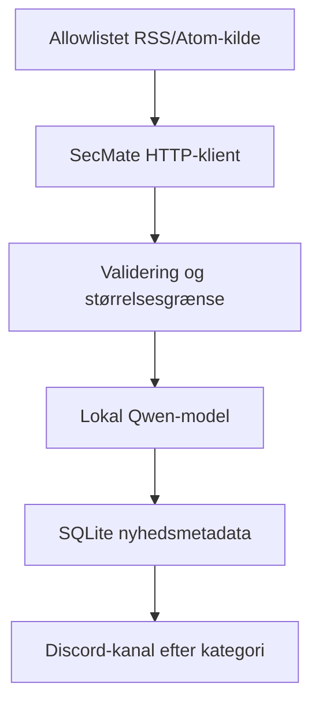

# Dataflow, datalagring og privatliv

## 1. Grundprincip

Systemet må ikke bruges til persondata, private noter om medstuderende, rigtige adgangskoder eller fortroligt materiale. Det tekniske design minimerer lagring, men gør ikke Discord anonymt: beskeder og Discord-identifikatorer behandles af Discord som nødvendig del af tjenesten.

## 2. Dataflow pr. funktion

### Spørgsmål til dokumenter

- Spørgsmålet kommer fra en Discord interaction.
- Discord behandler interaction og svaret.
- Botten bruger teksten i RAM under requesten.
- Ollama modtager prompten lokalt på samme host.
- SQLite returnerer relevante dokumentchunks.
- Prompt og svar gemmes ikke af SecMate.

### Hukommelse/deadline

- Kun den eksplicit valgte note/deadline gemmes.
- Brugerens navn, Discord user ID og den øvrige samtale gemmes ikke.
- Server-ID bruges til at adskille fælles data mellem Discord-servere.

### Nyheder

- Der sendes ikke data til en ekstern AI.
- Feeddata behandles som upålideligt indhold.
- Original kilde og link bevares; AI-resumé mærkes.

## 3. Dataregister

| Data | Kilde | Placering | Formål | Standardretention | Sendes videre |
|---|---|---|---|---|---|
| Discord slash-command tekst | Studerende | RAM | Udføre kommando | Kun requestens levetid | Discord og lokal Ollama |
| AI-svar | Lokal model | RAM/Discord | Svar til gruppen | Ikke gemt af SecMate | Discord |
| Fælles memory-note | Studerende | SQLite | Huske fælles ufølsom info | 90 dage eller manuel sletning | Vises i Discord |
| Deadline | Admin | SQLite | Plan og reminders | Til 30 dage efter complete/forfald | Vises i Discord |
| PDF/MD/TXT | Host | Lokal dokumentmappe | Fagligt grundlag | Til filen fjernes | Relevante uddrag til lokal Ollama |
| Dokumentchunk | Ingestion | SQLite | Retrieval | Til dokumentet fjernes/reindekseres | Lokal Ollama ved match |
| Embedding | Lokal embedmodel | SQLite | Similarity search | Samme som chunk | Ingen ekstern modtager |
| Nyhedstitel/summary/link | RSS | SQLite | Deduplikering og opslag | 30 dage | Lokal Ollama og Discord |
| Job-run status | Scheduler | SQLite | Undgå dubletter | 90 dage | Ingen |
| Tekniske logs | Applikation | Lokal logfil | Drift/fejl | 14 dage | Ingen |
| SQLite-backup | Applikation | Lokal backupmappe | Recovery | 7 nyeste kopier | Ingen |
| Discord bot-token | Discord Developer Portal | Lokal `.env` | Autentifikation | Til rotation | Discord ved login |

## 4. Hvad må aldrig gemmes

- navn, e-mail, telefonnummer, adresse eller CPR-nummer
- Discord-brugernavn, user ID, avatar eller medlemsliste
- individuelle karakterer, fravær, helbred eller præstationer
- adgangskoder, API-nøgler, tokens eller private links
- rå samtalehistorik
- lærer-/medstuderendenoter med identificerbare personer
- fortroligt, ophavsretligt ulovligt eller licensmæssigt forbudt materiale

UI-teksten ved `/remember` skal minde om dette. Automatisk simpel secret-scanning må afvise mønstre, der ligner bot tokens, private keys og almindelige API keys. Den må ikke påstå at opdage alle former for persondata.

## 5. Discord som ekstern databehandler/tjeneste

Selv om AI og dokument-RAG er lokal, er Discord ikke lokal. Spørgsmål, svar og automatiske opslag passerer gennem Discord. Gruppen skal derfor:

- bruge en server og kanaler oprettet til skoleprojektet
- undgå persondata og fortrolige dokumentuddrag
- undersøge Discord Privacy Policy, Developer Terms og gældende retention/vilkår før demoen
- bruge bot-konto/token til formålet, ikke en brugers login/adgangskode
- begrænse bot-rettigheder og serveradgang

## 6. Retention-job

Cleanup-jobbet skal køre dagligt og være testbart med en injiceret clock:

- slet memories med `expires_at_utc < now`
- slet completed/udløbne deadlines efter konfigureret frist
- slet news items efter frist
- slet gamle job-runs efter 90 dage
- roter/slet logs efter frist
- slet gamle backups, så kun 7 nyeste bevares
- kør `PRAGMA optimize`; kør ikke `VACUUM` på hver daglige cleanup

`/forget` og `/deadlines delete` er øjeblikkelig logisk/fysisk sletning fra den aktive database. Tidligere backups kan indeholde data indtil de roteres ud; dette skal forklares i README.

## 7. Dataejer og adgang

- Gruppen er dataejer for lokale filer/database.
- Host-ansvarlig har filsystemadgang.
- Discord-serverens medlemmer kan se det, kanalrettighederne tillader.
- Admin commands bruger Discord permissions ved hver interaction; roller lagres ikke som brugerprofiler.
- SQLite og `.env` skal ligge i en OS-brugerkonto, som andre lokale brugere ikke har adgang til.

## 8. Backup og restore

- Brug SQLite backup API, ikke rå kopiering af en aktiv WAL-database.
- Navn: `secmate-YYYYMMDD-HHMMSS.db`.
- Efter backup: kør `PRAGMA integrity_check` på backupkopien.
- Behold 7 kopier.
- Restore er manuel: stop bot, tag kopi af nuværende DB, valider backup, erstat DB, start og kør doctor.
- Dokumentfiler er ikke med i DB-backup og skal sikkerhedskopieres separat, hvis licensen tillader det.

## 9. Dataflow-oplysninger gruppen selv skal bekræfte før fremlæggelsen

- Discord-vilkår og privacy policy på datoen for fremlæggelsen
- licens/tilladelse til den konkrete PDF
- den faktiske host-computer og hvem der har adgang
- om log- og retentionværdierne blev beholdt eller ændret
- hvilke RSS-kilder der faktisk virker og er valgt

